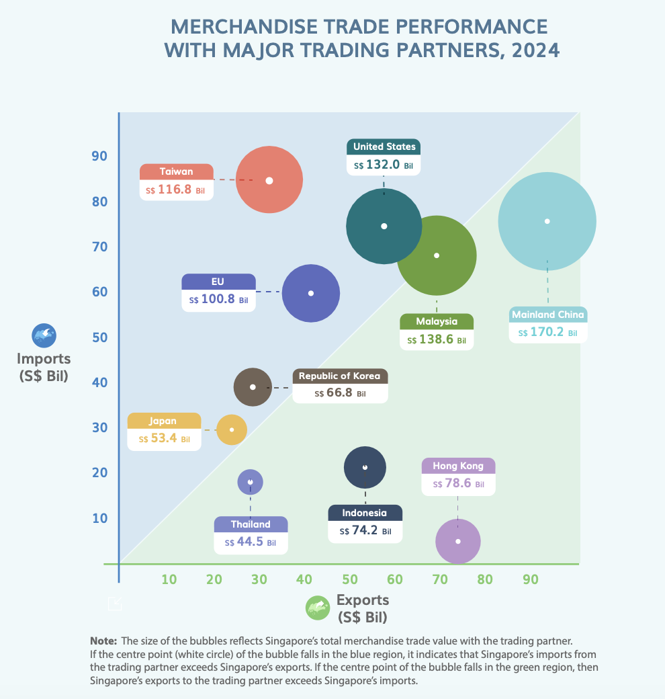
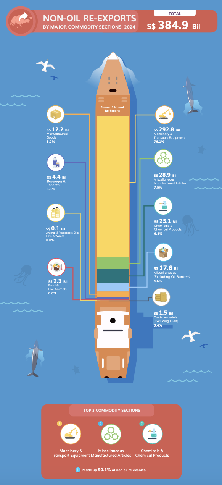
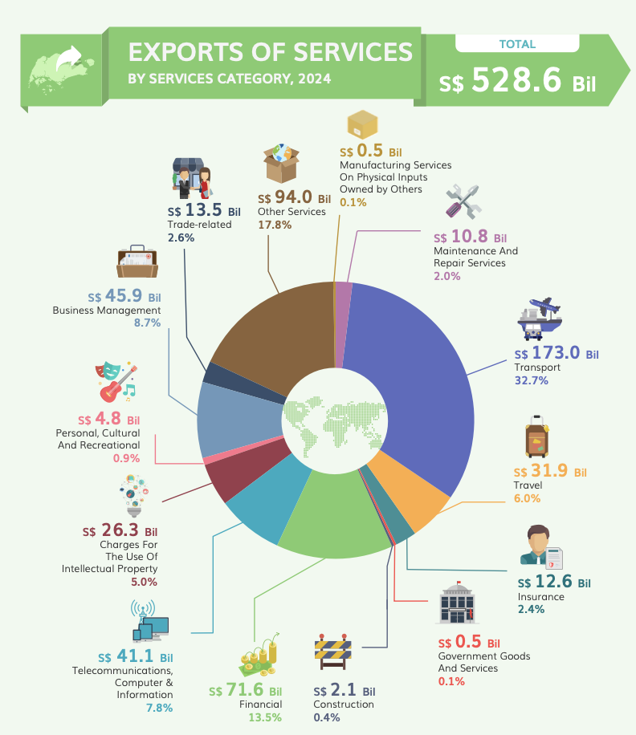

# 1 Overview

Since Mr. Donald Trump took office as the President of the United States on January 20, 2025, one of the most closely watched topics has been global trade.

As visual analytics novices, we are eager to apply newly acquired techniques to explore and analyze the changing trends and patterns of Singapore’s international trade since 2015.

# 2 Tasks

In this take-home exercise, we are going to complete two main tasks:

-   **Select and makeover three data visualisation** from [DOS International trade infographic report](https://www.singstat.gov.sg/modules/infographics/singapore-international-trade) using ggplot2 and other R packages

-   **Analyse the data with either time-series analysis or time-series forecasting methods** by compliment the analysis with appropriate data visualisation methods and R packages.

# 3 Load the packages

Use the **pacman** package `p_load()` to check, install and launch the following R packages:

```{r}
pacman::p_load(tidyverse, lubridate, gridExtra,
               CGPfunctions,patchwork,ggthemes,gganimate,
               ggtext,scales,patchwork,ggrepel,
               ggridges, ggdist, ggiraph, plotly, 
               knitr,ggiraph,ggstatsplot,readxl,
               tsibble,feasts,fable,seasonal)
```

| **Library** | **Description** |
|---------------------------|---------------------------------------------|
|  |  |
| tidyverse | a family of R packages for data processing |
| [**Plotly R**](https://plot.ly/r/) | an R package for creating interactive web-based graphs via plotly’s JavaScript graphing library. |

# 4 DOS Infographics Makeover

## 4.1 Merchandise Trade Performance With Major Trading Partners

This is the first graph we are going to makeover! It's about the **trading relationship between Singapore and its top 10 trading partners (by total trade amounts = import+export+re-export) in 2024**.

The countries in the blue area indicate that SG has trade deficit towards those countries, since SG's imports from those countries are greater than its exports to them.

{fig-align="center" width="440"}

-   **Pros:**

    1.  Uses the diagonal line and blocks to clearly show **trade deficit and surplus from major trading partners** of Singapore
    2.  The **note** explains the logic of visual design and improve users' understanding

-   **Cons:**

    1.  The graph only shows 2024 mechandise data, which lacks a complete view of merchandise trade trends in recent years.
    2.  Although it provides a note, the design of graph is not intuitive, meaning readers may overlook the note and misuderstand the graph

-   **Make-Over Suggestion**:

    1.  **Use animation combining multiple years of data** to enhance data storytelling and enable readers to observe trade relationship trends between Singapore and its major trading partners.
    2.  **Label SG Trade Deficit and SG Trade Surplus** **directly on the graph**, so readers can immediately understand the layout and meaning of it at first glance

### 4.1.1 Import Data

For the first graph makeover, we'll use data from [Merchandise Trade by Region/Market](https://www.singstat.gov.sg/find-data/search-by-theme/trade-and-investment/merchandise-trade/latest-data) available from DOS:

We will import the data using the `read_excel` function from the `readxl` package. By selecting the targeted range (Jan 2025-Jan2015), we can minimize data cleaning efforts.

```{r}
m_import <- read_excel("data/SGTrade_byMarket.xlsx",sheet = "T1",range="A11:DR171")
m_export <- read_excel("data/SGTrade_byMarket.xlsx",sheet = "T2",range="A11:DR171")
m_re_export <- read_excel("data/SGTrade_byMarket.xlsx",sheet = "T3",range="A11:DR171")
```

Overview of the data: The measure units of the value are "SG\$ Millions"

::: panel-tabset
## Import

```{r}
kable(head(m_import,10))
```

## Export

```{r}
kable(head(m_export,10))

```

## Re-export

```{r}
kable(head(m_re_export,10))

```
:::

### 4.1.2 Data Preperation

Since our target is to draw an animated scatter plot, we first use `gather()` of tidyr to transform the month-year column and use `left_join()` of dplyr to join three imported files by county and month-year.

Secondly, we use `mutate()` and `filter()` of dplyr to extract the year from the month-year column, create abbreviations of countries for yearly data, and filter the top 10 countries for our graph.

Below are the code for data preperation:

```{r}
# rename the col name of country
colnames(m_export)[1] <- "country"
colnames(m_re_export)[1] <- "country"
colnames(m_import)[1] <- "country"

# copy the structure and transform three data to long df 
m_by_country <- m_export %>%
  gather(key = month_year, value="export",-country)

m_re_export_long <- m_re_export %>%
  gather(key = month_year, value="re_export",-country)

m_import_long <- m_import %>%
  gather(key = month_year, value = "import",-country)

# join all data together
m_by_country <- m_by_country %>%
  left_join(m_re_export_long,by=c("country","month_year")) %>%
  left_join(m_import_long, by = c("country","month_year")) %>%
  mutate(total_trade = round(export+re_export+import,1),
         net_export = round((export+re_export)-import,1),
         abs_net_export = abs(round((export+re_export)-import,1)),
         year = as.integer(substr(month_year,1,4)))%>%
  filter(year != 2025)

# create yearly data for graph
m_by_country_year <- m_by_country %>%
  group_by(country,year) %>%
  summarise(across(c("export","re_export","import","net_export","abs_net_export","total_trade"),~sum(.x, na.rm = TRUE)/1000),.groups="drop")

# filter continent only
m_by_continent_year <- m_by_country_year %>%
  filter(country %in% c("America","Asia","Europe","Oceania","Africa","Total All Markets"))

# filter country only
m_by_country_year <- m_by_country_year %>%
  filter(!country %in% c("America","Asia","Oceania","Africa","Total All Markets"))

# calculate avg net export 
m_by_country_avg <- m_by_country_year %>%
  group_by(country)%>%
  summarise(across(c("export","re_export","import","net_export","abs_net_export","total_trade"),~round(mean(.x),1)),.groups="drop") %>%
  arrange(desc(total_trade))

# top 5 postive net export countries for SG
top_10_m_trade <- m_by_country_avg$country[1:10]

# filter top 10 trade countries
top_10_trade_country <- m_by_country_year %>%
  filter(country %in% top_10_m_trade) %>%
  mutate(total_export = re_export + export)

# define abbr of countries
country_abbr <- c(
  "Hong Kong" = "HK",
  "Indonesia" = "ID",
  "Malaysia" = "MY",
  "Thailand" = "TH",
  "China" = "CN",
  "Taiwan" = "TW",
  "United States" = "US",
  "Europe" = "EU",
  "Korea, Rep Of" = "KR",
  "Japan" = "JP"
)

# create new column 
top_10_trade_country <- top_10_trade_country %>%
  mutate(country_abbr = country_abbr[country])

```

### 4.1.3 Data Visualization Makeover

::: toggle
<details>

<summary>**Display Code**</summary>

``` r
my_palette <- c("#D989AE", "#96C6D9", "#F2CD88", "#D97259", "#468C6C", "grey60","#B3A2C7", "#E1A77C", "#7CA08B", "#C77C8C")

ggplot(data=top_10_trade_country,
       aes(x= total_export, y = import))+
  # lower part background
  annotate(geom = "polygon", 
           x = c(-Inf, Inf, Inf),
           y = c(-Inf, Inf, -Inf), 
           fill = "#34a853", alpha = 0.1)+
  # upper part background
  annotate(geom = "polygon", 
           x = c(Inf, -Inf, -Inf),
           y = c(Inf, -Inf, Inf), 
           fill = "#4285f4", alpha = 0.1)+
  annotate("text", x = 10, y = 90, label = "SG Trade\nDeficit", 
           color = "#4285f4", size = 4, hjust = 0.5, alpha=0.7) +
  annotate("text", x = 90, y = 20, label = "SG Trade\nSurplus", 
           color = "#34a853", size = 4, hjust = 0.5, alpha=0.7) +
  geom_point(
       aes(size = total_trade, color = country_abbr),
       alpha=0.7,
       show.legend = FALSE)+
         scale_colour_manual(values = my_palette)+
         scale_size(range = c(2,15))+
         labs(title = "Merchandise Trade Performance With Top 10 Trading Partners",
         subtitle = "Year: {frame_time}",
         x = "Annual Exports<br>S$ Bil",
         y = "Annual Imports<br>S$ Bil",
         caption = "Source: singstat.gov.sg")+
  geom_label(aes(label = country_abbr,
                 color = country_abbr),
             hjust=0.5, 
             vjust=-1,
             fill = NA,
             label.size = 0,
             show.legend = FALSE)+
  transition_time(year)+
  ease_aes('cubic-in-out')+
  coord_cartesian(xlim = c(0, 100), ylim = c(0, 100))+
  theme_classic()+
  theme(
    plot.title = element_markdown(size = 15, hjust = 0,face="bold"),
    axis.line.x = element_line(color = "#34a853"),
    axis.ticks.x = element_line(color = "#34a853"),
    axis.ticks.y = element_line(color = "#4285f4"), 
    axis.line.y = element_line(color = "#4285f4"),  
    axis.text.x = element_text(color = "#34a853"), 
    axis.text.y = element_text(color = "#4285f4"),
    axis.title.x = element_markdown(color = "#34a853",
                                margin = margin(t = 13),
                                hjust=1), 
    axis.title.y = element_markdown(color = "#4285f4",
                                margin = margin(r = 10),
                                hjust=1 ,angle = 360),
    panel.background = element_rect(fill = "#f3f1e9"),
    plot.background = element_rect(fill = "#f3f1e9", color = NA),
    plot.margin = margin(1, 1, 1, 1, "cm"), 
    panel.spacing = unit(2, "cm"))
  
```

</details>
:::

```{r}
#| echo: false
#| fig-height: 6
#| fig-width: 10
#| out-extra: "style='max-width:100%; display: block;'"
#| out-width: 100%

my_palette <- c("#D989AE", "#96C6D9", "#F2CD88", "#D97259", "#468C6C", "grey60", 
                      "#B3A2C7", "#E1A77C", "#7CA08B", "#C77C8C")

ggplot(data=top_10_trade_country,
       aes(x= total_export, y = import))+
  # lower part background
  annotate(geom = "polygon", 
           x = c(-Inf, Inf, Inf),
           y = c(-Inf, Inf, -Inf), 
           fill = "#34a853", alpha = 0.1)+
  # upper part background
  annotate(geom = "polygon", 
           x = c(Inf, -Inf, -Inf),
           y = c(Inf, -Inf, Inf), 
           fill = "#4285f4", alpha = 0.1)+
  annotate("text", x = 10, y = 90, label = "SG Trade\nDeficit", 
           color = "#4285f4", size = 4, hjust = 0.5, alpha=0.7) +
  annotate("text", x = 90, y = 20, label = "SG Trade\nSurplus", 
           color = "#34a853", size = 4, hjust = 0.5, alpha=0.7) +
  geom_point(
       aes(size = total_trade, color = country_abbr),
       alpha=0.7,
       show.legend = FALSE)+
         scale_colour_manual(values = my_palette)+
         scale_size(range = c(2,15))+
         labs(title = "Merchandise Trade Performance With Top 10 Trading Partners",
         subtitle = "Year: {frame_time}",
         x = "Annual Exports<br>S$ Bil",
         y = "Annual Imports<br>S$ Bil",
         caption = "Source: singstat.gov.sg ")+
  geom_label(aes(label = country_abbr,
                 color = country_abbr),
             hjust=0.5, 
             vjust=-1,
             fill = NA,
             label.size = 0,
             show.legend = FALSE)+
  transition_time(year)+
  ease_aes('cubic-in-out')+
  coord_cartesian(xlim = c(0, 100), ylim = c(0, 100))+
  theme_classic()+
  theme(
    plot.title = element_markdown(size = 15, hjust = 0,face="bold"),
    axis.line.x = element_line(color = "#34a853"),
    axis.ticks.x = element_line(color = "#34a853"),
    axis.ticks.y = element_line(color = "#4285f4"), 
    axis.line.y = element_line(color = "#4285f4"),  
    axis.text.x = element_text(color = "#34a853"), 
    axis.text.y = element_text(color = "#4285f4"),
    axis.title.x = element_markdown(color = "#34a853",
                                margin = margin(t = 13),
                                hjust=1), 
    axis.title.y = element_markdown(color = "#4285f4",
                                margin = margin(r = 10),
                                hjust=1 ,angle = 360),
    panel.background = element_rect(fill = "#f3f1e9"),
    plot.background = element_rect(fill = "#f3f1e9", color = NA),
    plot.margin = margin(1, 1, 1, 1, "cm"), 
    panel.spacing = unit(2, "cm"))
  
```

::: {.callout-note appearance="simple"}
## Observation

By animating the plot, we can observe :

1.  Singapore has consistently **maintained** **a trade deficit with Taiwan, the EU, and the US** (with 2020 being the only exception), while **maintaining a trade surplus with China, Hong Kong, Indonesia, and Thailand**.
2.  Overall, SIngapore's total **trade amount** with top 10 trade partners has gradully **increased** by years.
:::

## 4.2 NON-OIL RE-EXPORTS by Major Commodity

The second graph shows Singapore's non-oil re-exports (NORX) goods. DOS organized the data by proportion and amount, formatting it as a stacked bar chart.

{fig-align="center" width="251"}

-   **Pros:** Creative and attractive visual design (stacked bar chart shaped like boats)

-   **Cons:**

    1.  Difficult to read due to long vertical ship display and sparse data points

    2.  The proportions across categories are uneven, with "Machinery & Transportation" accounting for 76.1%, making it difficult to compare smaller categories. This issue is connected to the first cons.

    3.  Only shows 2024 data, making it hard to compare trends over time and less meaningful

    4.  The "Machinery & Transportation" icon (excavator) is somewhat misleading, as this category includes various types of machinery, which also integrated circuits, engines, and other components.

-   **Make-Over Suggestion**:

    1.  For improving the graph, we'll avoid visualization methods that directly compare categories. Instead, we'll use **newggslopegraph** of CGPfunctions to illustrate trends across multiple yearsand use **labels** display both the amounts and proportions of each category.
    2.  Additionally, it would be interesting if we also showed the data points for 2020 and 2022 to highlight if there were any **variations during COVID (2020–2022)**.

### 4.2.1 Import Data

The data [Merchandise Trade by Commodity Section/Division](https://www.singstat.gov.sg/find-data/search-by-theme/trade-and-investment/merchandise-trade/latest-data) will be used to make-over the second graph. As the first graph, we set the range to retrieve the data (Jan 2015 - Jan 2025).

```{r}
com_re_export <- read_excel("data/SGTrade_byCommodity.xlsx",sheet = "T1",range="A11:DR79")
```

```{r}
kable(head(com_re_export))
```

### 4.2.2 Data Preperaition

Since the data we need is at the 9 bottommost rows, we first need to **remove** other data. Here, we use **`indexing`** and the **"-" operator** to achieve this.

Next, we transform month-year and re-export values using `gather()` function of tidyr. Finally, we aggregate the data by country and year using `group_by()` and `summarise()` to retrieve the targeted yearly data.

```{r}

# keep non-oil re-xport data
non_oil_re_export <- com_re_export[-(1:59),] 

colnames(non_oil_re_export)[1] = "commodity"

non_oil_re_export <- non_oil_re_export %>%
  gather(key="month_year",value="re_export",-commodity)%>%
  mutate(year = as.ordered(substr(month_year,1,4)))%>%
  filter(year %in% c(2015,2020,2022,2024))%>%
  group_by(commodity,year)%>%
  summarise(re_export = round(sum(re_export,na.rm=TRUE)/1000000),.groups = "drop")

```

### 4.2.3 Data Visualization Makeover

As mentioned in section 4.2.1 regarding the uneven proportions of re-export commodities, we use two newggslopegraphs: one for Machinery and Transportation Equipment and another for the rest, and use patchwork to combine them:

::: toggle
<details>

<summary>**Display Code**</summary>

``` r
p1 <- non_oil_re_export %>%
  group_by(year) %>%
  mutate(total_re_export_year = sum(re_export, na.rm = TRUE), 
         proportion = round(re_export / total_re_export_year * 100),
         label = ifelse(year %in% c(2015,2020,2022,2024),
                        paste0("$ ",comma(re_export)," B / ",proportion,"%"),
                        NA))%>% 
  ungroup()%>%
  filter(commodity == "Machinery & Transport Equipment") %>%
  newggslopegraph(year, re_export, commodity,
                  Title = "<span style='color:black;'>NON-OIL RE-EXPORT by MAJOR COMMODITY</span><br>",
                  SubTitle = "**What Was Brewing During the COVID-19 Pandemic?**<br><span style='color:#34a853;'>**Machinery & Transportation Equipment**</span> not only withstood the impacts of COVID,but also saw<br>a **37% surge** in re-export trade during the period.<br> <br> ",
                  Data.label = label,
                  Caption = NULL,
                  DataLabelPadding = 0.5,
                  DataLabelFillColor = "#f3f1e9",
                  LineColor = "#34a853") +
  annotate("rect", xmin = 2, xmax = 3, ymin = -Inf, ymax = Inf, 
         fill = "gray", alpha = 0.25)+
    geom_segment(aes(x = 1.7, y = 240, xend = 2, yend = 250),
               linetype = "solid", color = "grey20", size = 0.5,
               arrow = arrow(length = unit(0.03, "npc"))) +
    geom_richtext(
    aes(x = 1.7, y = 240, 
        label = "**Machine & Transportation Equipment**<br>NORX surged **37%** during COVID due to <br><span style='color:#D97259;'>**high demand of ICs, specialised and<br>electrical machinery, and engines & motor** </span>"),
    fill = NA, label.color = NA, 
    color = "grey20", size = 3, hjust = 1, alpha = 0.7
  ) +
  theme(axis.ticks = element_blank(),
        plot.title = element_markdown(size = 15, hjust = 0.5, face = "bold",lineheight = 0.8),
        plot.subtitle = element_markdown(size = 12, hjust = 0.5,lineheight = 1.3),
        legend.title = element_text(size = 8),
        legend.text = element_text(size = 6),
        panel.background = element_rect(fill = "#f3f1e9", color = NA),
        plot.background = element_rect(fill = "#f3f1e9", color = NA),
        axis.text.x = element_blank(),
        axis.text.y = element_blank())


p2 <- non_oil_re_export %>%
  group_by(year) %>%
  mutate(total_re_export_year = sum(re_export, na.rm = TRUE), 
         proportion = round(re_export / total_re_export_year * 100),
         label = ifelse(year %in% c(2015,2024),
                        paste0("$ ",comma(re_export)," B / ",proportion,"%"),
                        NA))%>% 
  ungroup()%>%
  filter(commodity != "Machinery & Transport Equipment") %>%
  
  newggslopegraph(year, re_export, commodity,
                  Title = NULL,
                  SubTitle = NULL,
                  Caption = "Source: singstat.gov.sg",
                  Data.label = label,
                  DataLabelPadding = 0,
                  DataLabelFillColor = "#f3f1e9",
                  LineColor = c(rep("#B0B0B0",8))) + 
  scale_x_discrete(position = "bottom")+
  annotate("rect", xmin = 2, xmax = 3, ymin = -Inf, ymax = Inf, 
         fill = "gray", alpha = 0.25)+
  theme(axis.ticks = element_blank(),
        plot.title = element_text(size = 10, hjust = 1, face = "bold"),
        legend.title = element_text(size = 8),
        legend.text = element_text(size = 6),
        panel.background = element_rect(fill = "#f3f1e9", color = NA),
        plot.background = element_rect(fill = "#f3f1e9", color = NA),
        axis.text.x = element_blank(),
        axis.text.y = element_blank())


p1 <- p1 + theme(plot.margin = margin(20, 5, -5, 5))
p2 <- p2 + theme(plot.margin = margin(-5, 5, 10, 5))
combined_plot <- p1 / p2
combined_plot
```

</details>
:::

```{r}
#| echo: false
#| fig-height: 6
#| fig-width: 10
#| out-extra: "style='max-width:100%; display: block;'"
#| out-width: 100%


p1 <- non_oil_re_export %>%
  group_by(year) %>%
  mutate(total_re_export_year = sum(re_export, na.rm = TRUE), 
         proportion = round(re_export / total_re_export_year * 100),
         label = ifelse(year %in% c(2015,2020,2022,2024),
                        paste0("$ ",comma(re_export)," B / ",proportion,"%"),
                        NA))%>% 
  ungroup()%>%
  filter(commodity == "Machinery & Transport Equipment") %>%
  newggslopegraph(year, re_export, commodity,
                  Title = "<span style='color:black;'>NON-OIL RE-EXPORT by MAJOR COMMODITY</span><br>",
                  SubTitle = "**What Was Brewing During the COVID-19 Pandemic?**<br><span style='color:#34a853;'>**Machinery & Transportation Equipment**</span> not only withstood the impacts of COVID,but also saw<br>a **37% surge** in re-export trade during the period.<br> <br> ",
                  Data.label = label,
                  Caption = NULL,
                  DataLabelPadding = 0.5,
                  DataLabelFillColor = "#f3f1e9",
                  LineColor = "#34a853") +
  annotate("rect", xmin = 2, xmax = 3, ymin = -Inf, ymax = Inf, 
         fill = "gray", alpha = 0.25)+
    geom_segment(aes(x = 1.7, y = 240, xend = 2, yend = 250),
               linetype = "solid", color = "grey20", size = 0.5,
               arrow = arrow(length = unit(0.03, "npc"))) +
    geom_richtext(
    aes(x = 1.7, y = 240, 
        label = "**Machine & Transportation Equipment**<br>NORX surged **37%** during COVID due to <br><span style='color:#D97259;'>**high demand of ICs, specialised and<br>electrical machinery, and engines & motor** </span>"),
    fill = NA, label.color = NA, 
    color = "grey20", size = 3, hjust = 1, alpha = 0.7
  ) +
  theme(axis.ticks = element_blank(),
        plot.title = element_markdown(size = 15, hjust = 0.5, face = "bold",lineheight = 0.8),
        plot.subtitle = element_markdown(size = 12, hjust = 0.5,lineheight = 1.3),
        legend.title = element_text(size = 8),
        legend.text = element_text(size = 6),
        panel.background = element_rect(fill = "#f3f1e9", color = NA),
        plot.background = element_rect(fill = "#f3f1e9", color = NA),
        axis.text.x = element_blank(),
        axis.text.y = element_blank())


p2 <- non_oil_re_export %>%
  group_by(year) %>%
  mutate(total_re_export_year = sum(re_export, na.rm = TRUE), 
         proportion = round(re_export / total_re_export_year * 100),
         label = ifelse(year %in% c(2015,2024),
                        paste0("$ ",comma(re_export)," B / ",proportion,"%"),
                        NA))%>% 
  ungroup()%>%
  filter(commodity != "Machinery & Transport Equipment") %>%
  
  newggslopegraph(year, re_export, commodity,
                  Title = NULL,
                  SubTitle = NULL,
                  Caption = "Source: singstat.gov.sg",
                  Data.label = label,
                  DataLabelPadding = 0,
                  DataLabelFillColor = "#f3f1e9",
                  LineColor = c(rep("#B0B0B0",8))) + 
  scale_x_discrete(position = "bottom")+
  annotate("rect", xmin = 2, xmax = 3, ymin = -Inf, ymax = Inf, 
         fill = "gray", alpha = 0.25)+
  theme(axis.ticks = element_blank(),
        plot.title = element_text(size = 10, hjust = 1, face = "bold"),
        legend.title = element_text(size = 8),
        legend.text = element_text(size = 6),
        panel.background = element_rect(fill = "#f3f1e9", color = NA),
        plot.background = element_rect(fill = "#f3f1e9", color = NA),
        axis.text.x = element_blank(),
        axis.text.y = element_blank())


p1 <- p1 + theme(plot.margin = margin(20, 5, -5, 5))
p2 <- p2 + theme(plot.margin = margin(-5, 5, 10, 5))
combined_plot <- p1 / p2
combined_plot

```

::: {.callout-caution appearance="simple"}
## Insight

From the slope graph above, we can observe:

1.  **Increased Re-Exports**:

    Except for Miscellaneuos(Excluding bunkers), other categories re-export amount got increased from 2015 to 2024, suggesting re-export markets getting more active and **foreign trade or global supply chains are expanding, with more goods being processed through the region**.

2.  **Increase for Machinery and Transportation Equipment:**

    This category includes various **high-tech products** such as electronics, semiconductors, precision engineering equipment, and medical devices. With the **AI and technology boom**, the **demand** for electronics and semiconductor equipment (including ICs) **has surged**.

3.  **Increase for Miscellaneous Manufactured Goods**:

    This category includes footwear, jewellery, apparel and households goods. The booming e-commerce sector has served as a key driver of growth.
:::

## 4.3 Export of Service by Service Category

{fig-align="center" width="434"}

-   **Pros**:

    1.  Icons and colors help differentiate service sectors, making it visually appealing

    2.  Allows users to easily recognize import amounts and percentages

-   **Cons**:

    1.  Too cluttered (12 service sectors in a pie chart)

    2.  Hard to compare variations across years

-   **Make-Over Suggestion**:

    1.  Visualize **top 5 service export partners** using line graphs and facet_wrap() to see trends by country and service category over time

    2.  Use bar charts to compare the total service exports by country

    3.  Use **patchwork** and **ggiraph** to combine graphs creating interactive visualizations

### 4.3.1 Import Data

We import the data [International Trade in Services](https://www.singstat.gov.sg/find-data/search-by-theme/trade-and-investment/trade-in-services/latest-data) from DOS:

```{r}
# import service export data 

service_export <- read_excel("data/SGTrade_byService.xlsx",sheet = "T4",range="A11:J271")

```

```{r}
kable(head(service_export))
```

### 4.3.2 Data Preperation

Since the "data series" column contains both markets and service categories, we need to extract this information and create two separate columns—one for country and another for service type.

As we're focusing on comparing individual countries and selecting the top 5, we've removed regional markets like the EU, Americas, and ASEAN. These regions include too many countries, making it difficult to discover clear trends.

Finally, we'll follow the same process used in our previous two plots to transform the date columns and values into two distinct columns:

```{r}

# list of trading partners
counterparts <- c("United States Of America", "Hong Kong", "India", "Indonesia", "Japan", 
               "Mainland China", "Malaysia", "Philippines", "Republic Of Korea", "Thailand",
               "United Arab Emirates","France", "Germany", "Netherlands", "United Kingdom",
               "Australia","America", "Asia","Europe","Oceania")

# list of services
services <- c("Transport", "Business Management", "Other Services", 
              "Telecommunications, Computer & Information", "Financial", 
              "Insurance", "Maintenance And Repair Services", "Trade-Related", 
              "Manufacturing Services On Physical Inputs Owned By Others",
              "Government Goods And Services", "Construction", 
              "Charges For The Use Of Intellectual Property", 
              "Personal, Cultural And Recreational")

# create two columns -- Country & Service
service_export <- service_export%>%
  mutate(Country = if_else(service_export$`Data Series` %in% counterparts,`Data Series`,NA),
         Service = if_else(service_export$`Data Series` %in% services,`Data Series`,NA))

# fill in blanks of Country & service
service_export <- service_export%>%
  fill(Country, .direction = "down")%>%
  replace_na(list(Service = "Total Service Exports")) %>%
  select(-`Data Series`)

# trasform years from col to rows 
service_export <- service_export %>%
  gather(key=year, value = "export", -c(Service,Country))%>%
  mutate(export = str_replace_all(export, "na", "0")) %>%
  mutate(export = as.numeric(export)) 

# filter countries w/o total 
s_export_ct <- service_export %>%
  filter(!Country %in% c('America',"Asia","Europe","Oceania")) %>%
  filter(Service != "Total Service Exports") %>%
  mutate(export=export/1000)

# rename countries
s_export_ct <- s_export_ct %>%
  mutate(Country = str_replace_all(Country, 
                                   c("United States Of America" = "USA",
                                     "Mainland China" = "China",
                                     "United Kingdom" = "UK")))

# filter countries with total
s_export_ct_total <- s_export_ct %>%
  group_by(Country)%>%
  summarise(total_exp = mean(export,na.rm=TRUE)/1000,.groups ="drop") %>%
  arrange(desc(total_exp))

```

### 4.3.3 Data Visualization Makeover

::: toggle
<details>

<summary>**Display Code**</summary>

``` r

# filter only top 5 service export partners
top5_service_country <- s_export_ct_total$Country[1:5] 

top5_service_exp <- s_export_ct %>%
  filter(Country %in% top5_service_country)

# ref line: calculate the average export by Service type
avg_export_by_service <- top5_service_exp %>%
  group_by(Service) %>%
  summarise(avg_export = mean(export, na.rm = TRUE), .groups = "drop")

# total export by country
sum_export_by_country <- top5_service_exp %>%
  group_by(Country,year) %>%
  summarise(sum_export = sum(export, na.rm = TRUE), .groups = "drop")

# ref line: average export
avg_ser_export <- sum_export_by_country %>%
  summarise(avg_export = mean(sum_export, na.rm = TRUE), .groups = "drop")

# sort the levels for factors
top5_service_exp$Country <- factor(top5_service_exp$Country, 
                                   levels = c("UK","Australia","Japan",
                                               "China","USA"),
                                   ordered = TRUE)
sum_export_by_country$Country <- factor(sum_export_by_country$Country, 
                                   levels = c("UK","Australia","Japan",
                                               "China","USA"),
                                   ordered = TRUE)

p1 <- ggplot(top5_service_exp, 
             aes(x = year, y = export, 
                 color = Country, group=Country)) +
  geom_line_interactive(aes(data_id = Country),size = 1) +
  scale_color_manual(values = my_palette) +
  facet_wrap(~Service, scales = "free_y",
             labeller = label_wrap_gen(width = 20))+
  geom_hline(data = avg_export_by_service, 
             aes(yintercept = avg_export,
                 linetype = "Mean"), # add linetype to the legend
             color = "grey30",
             size = 0.7) +
  scale_linetype_manual(name = "Reference", values = c("Mean"="dashed"))+
  guides(
    fill = guide_legend(order = 1),
    linetype = guide_legend(order = 2) # Adds linetype to the legend
  ) +
  labs(title = "Singapore's Services Exports: Top 5 Partners (2015–2023)",
       subtitle = "Service Exports Top 5 Countries: US, China, Japan, Austalia and UK\nAnalyzing trends and growth in various services.",
       x = "Year", y = "Export Value (S$ Bil)") +
  theme_minimal() +
  theme(plot.title = element_text(size = 11, hjust = 0.5, face = 'bold'),
        plot.subtitle = element_text(size = 8, hjust = 0.5),
        axis.title = element_text(size = 8),
        axis.text.x = element_text(size = 6,angle=90),
        legend.position = 'top',
        legend.background = element_blank(),
        legend.key = element_blank(), 
        legend.title = element_text(size = 9),
        legend.text = element_text(size = 8),
        panel.background = element_rect(fill = "#f3f1e9",color=NA),
        plot.background = element_rect(fill = "#f3f1e9", color = NA))


p2 <-ggplot(top5_service_exp, 
            aes(x = Country, y= export,fill = Country)) +
  geom_bar_interactive(aes(data_id = Country,
                           #tooltip = tooltip
                           ),
                       stat = "identity",
                       position = position_dodge(width = 0.7),) +  
  scale_fill_manual(values = my_palette) +  
  labs(y = "Export Value (S$ Bil)",
       caption="Source: singstat.gov.sg") +
  coord_flip() +
  theme_minimal() +
  theme(
    legend.position = "none",
    legend.background = element_blank(),
    legend.key = element_blank(), 
    axis.title = element_text(size = 8),
    panel.background = element_rect(fill = "#f3f1e9", color = NA),  
    plot.background = element_rect(fill = "#f3f1e9", color = NA))


p3 <- ggplot(sum_export_by_country, 
             aes(x = year, y = sum_export, 
                 color = Country, group=Country)) +
  geom_line_interactive(aes(data_id = Country),size = 1) +
  scale_color_manual(values = my_palette) +
  labs(subtitle=NULL,y = "Export Value (S$ Bil)")+
  annotate(geom="text",x=1.5, y=80,
           label="Total Services Exports by Country",
           hjust=0,size=3,face='bold')+
  geom_hline(data = avg_ser_export, 
             aes(yintercept = avg_export),
             linetype = "dashed",
             color = "grey30",
             size = 0.7) +
  theme_minimal() +
  theme(legend.position = "none",
        axis.title = element_text(size = 8),
        axis.text.x = element_text(size = 6,angle=90),
        plot.caption = element_text(size = 3, color="grey40"),
        panel.background = element_rect(fill = "#f3f1e9",color=NA),
        plot.background = element_rect(fill = "#f3f1e9", color = NA))

hover_css <- "fill:#A4A9D9; stroke:black ;stroke-width:1px;"
tooltip_css <- "background-color:white; font-style: bold; color:black; border-radius: 5px; margin: 3px; padding:3px;"  

patch <- p1+(p3/p2)+ plot_layout(width = c(3, 1))


girafe(ggobj = patch,
       width_svg = 12,
       height_svg = 6,
       options = list(
       opts_hover(css = "stroke-width:3px; opacity: 1;"),
       opts_hover_inv(css = "opacity: 0.1;")
  ))
```

</details>
:::

```{r}
#| echo: false

# filter only top 5 service export partners
top5_service_country <- s_export_ct_total$Country[1:5] 

top5_service_exp <- s_export_ct %>%
  filter(Country %in% top5_service_country)

# ref line: calculate the average export by Service type
avg_export_by_service <- top5_service_exp %>%
  group_by(Service) %>%
  summarise(avg_export = mean(export, na.rm = TRUE), .groups = "drop")

# total export by country
sum_export_by_country <- top5_service_exp %>%
  group_by(Country,year) %>%
  summarise(sum_export = sum(export, na.rm = TRUE), .groups = "drop")

# ref line: average export
avg_ser_export <- sum_export_by_country %>%
  summarise(avg_export = mean(sum_export, na.rm = TRUE), .groups = "drop")

# sort the levels for factors
top5_service_exp$Country <- factor(top5_service_exp$Country, 
                                   levels = c("UK","Australia","Japan",
                                               "China","USA"),
                                   ordered = TRUE)
sum_export_by_country$Country <- factor(sum_export_by_country$Country, 
                                   levels = c("UK","Australia","Japan",
                                               "China","USA"),
                                   ordered = TRUE)

p1 <- ggplot(top5_service_exp, 
             aes(x = year, y = export, 
                 color = Country, group=Country)) +
  geom_line_interactive(aes(data_id = Country),size = 1) +
  scale_color_manual(values = my_palette) +
  facet_wrap(~Service, scales = "free_y",
             labeller = label_wrap_gen(width = 20))+
  geom_hline(data = avg_export_by_service, 
             aes(yintercept = avg_export,
                 linetype = "Mean"), # add linetype to the legend
             color = "grey30",
             size = 0.7) +
  scale_linetype_manual(name = "Reference", values = c("Mean"="dashed"))+
  guides(
    fill = guide_legend(order = 1),
    linetype = guide_legend(order = 2) # Adds linetype to the legend
  ) +
  labs(title = "Singapore's Services Exports: Top 5 Partners (2015–2023)",
       subtitle = "Service Exports Top 5 Countries: US, China, Japan, Austalia and UK\nAnalyzing trends and growth in various services.",
       x = "Year", y = "Export Value (S$ Bil)") +
  theme_minimal() +
  theme(plot.title = element_text(size = 11, hjust = 0.5, face = 'bold'),
        plot.subtitle = element_text(size = 8, hjust = 0.5),
        axis.title = element_text(size = 8),
        axis.text.x = element_text(size = 6,angle=90),
        legend.position = 'top',
        legend.background = element_blank(),
        legend.key = element_blank(), 
        legend.title = element_text(size = 9),
        legend.text = element_text(size = 8),
        panel.background = element_rect(fill = "#f3f1e9",color=NA),
        plot.background = element_rect(fill = "#f3f1e9", color = NA))


p2 <-ggplot(top5_service_exp, 
            aes(x = Country, y= export,fill = Country)) +
  geom_bar_interactive(aes(data_id = Country,
                           #tooltip = tooltip
                           ),
                       stat = "identity",
                       position = position_dodge(width = 0.7),) +  
  scale_fill_manual(values = my_palette) +  
  labs(y = "Export Value (S$ Bil)",
       caption="Source: singstat.gov.sg") +
  coord_flip() +
  theme_minimal() +
  theme(
    legend.position = "none",
    legend.background = element_blank(),
    legend.key = element_blank(), 
    axis.title = element_text(size = 8),
    panel.background = element_rect(fill = "#f3f1e9", color = NA),  
    plot.background = element_rect(fill = "#f3f1e9", color = NA))


p3 <- ggplot(sum_export_by_country, 
             aes(x = year, y = sum_export, 
                 color = Country, group=Country)) +
  geom_line_interactive(aes(data_id = Country),size = 1) +
  scale_color_manual(values = my_palette) +
  labs(subtitle=NULL,y = "Export Value (S$ Bil)")+
  annotate(geom="text",x=1.5, y=80,
           label="Total Services Exports by Country",
           hjust=0,size=3,face='bold')+
  geom_hline(data = avg_ser_export, 
             aes(yintercept = avg_export),
             linetype = "dashed",
             color = "grey30",
             size = 0.7) +
  theme_minimal() +
  theme(legend.position = "none",
        axis.title = element_text(size = 8),
        axis.text.x = element_text(size = 6,angle=90),
        plot.caption = element_text(size = 3, color="grey40"),
        panel.background = element_rect(fill = "#f3f1e9",color=NA),
        plot.background = element_rect(fill = "#f3f1e9", color = NA))

hover_css <- "fill:#A4A9D9; stroke:black ;stroke-width:1px;"
tooltip_css <- "background-color:white; font-style: bold; color:black; border-radius: 5px; margin: 3px; padding:3px;"  

patch <- p1+(p3/p2)+ plot_layout(width = c(3, 1))


girafe(ggobj = patch,
       width_svg = 12,
       height_svg = 6,
       options = list(
       opts_hover(css = "stroke-width:3px; opacity: 1;"),
       opts_hover_inv(css = "opacity: 0.1;")
  ))

```

### 4.3.4 Shiny APP

Since there are 12 service types which make all graphs appear tiny and difficult to read, we can use Shiny and dropdown lists to resolve this issue.

To minimize data processing steps when loading the Shiny app, we first need to export the processed data to our folder and then import to the app.R (the Shiny file)

```{r}
write.csv(top5_service_exp, file = "top5_service_exp.csv", row.names = FALSE)
```

Below is the link and code for Shiny APP:

[Click me to see](https://johsuanh.shinyapps.io/Take-Home_Ex2/)

::: toggle
<details>

<summary>**Display Code**</summary>

``` r

pacman::p_load(shiny,tidyverse,ggplot2,ggiraph,patchwork)


top5_service_exp <- read.csv("data/top5_service_exp.csv")
list.files()
my_palette <- c("#D989AE", "#96C6D9", "#F2CD88", "#D97259", "#468C6C", "grey60","#B3A2C7", "#E1A77C", "#7CA08B", "#C77C8C")


# create dropdown list for service selection
ui <- fluidPage(
  tags$style(HTML("
    body {
      background-color: #ffffff;
      font-family: 'Calibri', sans-serif;
    }
    select, input {
      font-family: 'Calibri', sans-serif;
    }
  ")),

  titlePanel("Singapore's Services Exports: Top 5 Partners"),
  
  sidebarLayout(
    sidebarPanel(
      selectInput("selected_service", "Select a Service:", 
                  choices = unique(top5_service_exp$Service), 
                  selected = unique(top5_service_exp$Service)[1])
    ),
    
    mainPanel(
      girafeOutput("export_plot")
    )
  )
)

# filter data and update plots
server <- function(input, output) {
  output$export_plot <- renderGirafe({
    # filter dataset based on selected Service
    filtered_data <- top5_service_exp %>% filter(Service == input$selected_service)
    
    # reference line
    avg_export_by_service <- filtered_data %>%
      group_by(Service) %>%
      summarise(avg_export = mean(export, na.rm = TRUE), .groups = "drop")
    
    sum_export_by_country <- filtered_data %>%
      group_by(Country, year) %>%
      summarise(sum_export = sum(export, na.rm = TRUE), .groups = "drop")
    
    avg_ser_export <- sum_export_by_country %>%
      summarise(avg_export = mean(sum_export, na.rm = TRUE), .groups = "drop")
    
    # Main line plot by service type
    p1 <- ggplot(filtered_data, 
                 aes(x = year, y = export, color = Country, group = Country)) +
      geom_line_interactive(aes(data_id = Country), size = 1) +
      scale_color_manual(values = my_palette) +
      facet_wrap(~Service, scales = "free_y") +
      geom_hline(data = avg_export_by_service, aes(yintercept = avg_export, linetype = "Mean"), 
                 color = "grey30", size = 0.7) +
      scale_linetype_manual(name = "Reference", values = c("Mean"="dashed")) +
      labs(title = paste("Service Export Trends:", input$selected_service),
           x = "Year", y = "Export Value (S$ Bil)") +
      theme_minimal() +
      theme(
        legend.position = "top",
        plot.title = element_text(hjust = 0.5,size=16,face="bold"))
    
    # bar plot by country
    p2 <- ggplot(filtered_data, 
                 aes(x = Country, y = export, fill = Country)) +
      geom_bar_interactive(aes(data_id = Country),
                           stat = "identity", 
                           position = position_dodge(width = 0.7),width=0.5) +  
      scale_fill_manual(values = my_palette) +  
      labs(y = "Export Value (S$ Bil)", caption = "Source: singstat.gov.sg") +
      coord_flip() +
      theme_minimal() +
      theme(legend.position = "none")
    
    # box plot by country
    p3 <- ggplot(sum_export_by_country, 
                 aes(x = year, y = sum_export, fill = Country, group = Country)) +
      geom_boxplot_interactive(aes(data_id = Country), size = 1) +
      scale_fill_manual(values = my_palette) +
      geom_hline(data = avg_ser_export, aes(yintercept = avg_export), linetype = "dashed", 
                 color = "grey30", size = 0.7) +
      labs(y = "Total Export Value (S$ Bil)") +
      theme_minimal() +
      theme(legend.position = "none")
    
    patch <- p1 + (p3 / p2) + plot_layout(widths = c(3, 1))
    
    girafe(ggobj = patch, width_svg = 12, height_svg = 6, 
           options = list(opts_hover(css = "stroke-width:3px; opacity: 1;"),
                          opts_hover_inv(css = "opacity: 0.1;")))
  })
}

shinyApp(ui, server)

```

</details>
:::

::: callout-caution
## Insight

Let's analyze the graph by sector:

-   **Transport**: As the line graph shows, transport service fees (which include carriage for both goods and travelers) began increasing in 2020 and peaked in 2022. Since many countries had travel restrictions during 2020–2022, the high fees were likely due to surging goods carriage costs. Hence, after 2022, the transport export gradually decreased.

-   
:::

# 5 Time-Series Analysis

We are curious about the trade relationship between Singapore and the USA in recent years. We will analyze imports, exports, and re-exports from January 2015 to January 2025 to identify trends and seasonality patterns.

## 5.1 Decomposition of STL

We first use STL of stats package to decompose data into trend, seasonal and remainder (random noise):

::: toggle
<details>

<summary>**Display Code**</summary>

``` r
# filter US data
m_usa <- m_by_country %>%
  filter(country == "United States") %>%
  select(country, month_year, import, export, re_export) %>%
  mutate(month_year = yearmonth(month_year))%>%
  select(-country)

# transform data from wide to long
m_usa_long <- m_usa %>%
  pivot_longer(cols = c(re_export, import, export), 
               names_to = "type", values_to = "value")%>%
  as_tsibble(index = month_year,key=type)

# plot STL graph
m_usa_long %>%
  model(stl = STL(value)) %>%
  components() %>%
  autoplot()+
  theme_minimal()+
    theme(plot.title = element_text(hjust = 0.5, face = 'bold'),
        plot.subtitle = element_text(hjust = 0.5),
        axis.title = element_text(size = 8),
        legend.position = 'top',
        legend.background = element_blank(),
        legend.key = element_blank(), 
        panel.background = element_rect(fill = "#f3f1e9",color=NA),
        plot.background = element_rect(fill = "#f3f1e9", color = NA))
```

</details>
:::

```{r}
#| echo: false
#| fig-height: 6

# filter US data
m_usa <- m_by_country %>%
  filter(country == "United States") %>%
  select(country, month_year, import, export, re_export) %>%
  mutate(month_year = yearmonth(month_year))%>%
  select(-country)

# transform data from wide to long
m_usa_long <- m_usa %>%
  pivot_longer(cols = c(re_export, import, export), 
               names_to = "type", values_to = "value")%>%
  as_tsibble(index = month_year,key=type)

# plot STL graph
m_usa_long %>%
  model(stl = STL(value)) %>%
  components() %>%
  autoplot()+
  labs(title="STL Decomposition of Singapore-US Trade Trends",
       subtitle = "Significant residual variation emerges from January 2020 onward.\n# In this plot, value(S$ million) = trend + seasonal + remainder.",
       caption = "Source: singstat.gov.sg")+
  geom_vline(xintercept = as.Date("2020-01-01"), linetype = "dashed", color = "grey60") + 
  theme_minimal()+
    theme(plot.title = element_text(hjust = 0.5, face = 'bold'),
        plot.subtitle = element_text(hjust = 0.5),
        axis.title = element_text(size = 8),
        legend.position = 'top',
        legend.background = element_blank(),
        legend.key = element_blank(), 
        panel.background = element_rect(fill = "#f3f1e9",color=NA),
        plot.background = element_rect(fill = "#f3f1e9", color = NA))
```

::: {.callout-important appearance="simple"}
## Insight

Following the dashed line, from January 2020 onwards, the variation in both **imports and exports to the US** of both **value and remainder panels** becomes noticeably more volatile compared to the pre-January 2020 period.

Trend-wise, there are slight upward trends for import, export, and re-export.

Seasonal-wise, although we can see clear seasonal patterns for each trade type, the range of variation is smaller than in the other three panels, suggesting the seasonal variation is weaker.
:::

## 5.2 Cycle plot

::: toggle
<details>

<summary>**Display Code**</summary>

``` r
m_usa_long%>% 
  gg_subseries(value)+
  theme_minimal()+
  labs(title="Cycle Plot of Singapore–US Trade Relations",
       subtitle = "There is no clear cyclical pattern, but a distinct seasonal pattern in the trade volume\nbetween USA and SG, with the lowest point in Feb, peaking in Mar, \nand gradually declining until the following Feb")+
    theme(plot.title = element_text(size = 11, hjust = 0.5, face = 'bold'),
        plot.subtitle = element_text(size = 8, hjust = 0.5),
        axis.title = element_text(size = 8),
        axis.text.x = element_text(size = 4,angle=90),
        axis.text.y = element_text(size = 5),
        legend.position = 'top',
        legend.background = element_blank(),
        legend.key = element_blank(), 
        legend.title = element_text(size = 9),
        legend.text = element_text(size = 8),
        panel.background = element_rect(fill = "#f3f1e9",color=NA),
        plot.background = element_rect(fill = "#f3f1e9", color = NA))
```

</details>
:::

```{r}
m_usa_long%>% 
  gg_subseries(value)+
  theme_minimal()+
  labs(title="Cycle Plot of Singapore–US Trade Relations",
       subtitle = "There is no clear cyclical pattern, but a distinct seasonal pattern in the trade volume\nbetween USA and SG, with the lowest point in Feb, peaking in Mar, \nand gradually declining until the following Feb",
       caption = "Source: singstat.gov.sg")+
    theme(plot.title = element_text(size = 11, hjust = 0.5, face = 'bold'),
        plot.subtitle = element_text(size = 8, hjust = 0.5),
        axis.title = element_text(size = 8),
        axis.text.x = element_text(size = 4,angle=90),
        axis.text.y = element_text(size = 5),
        plot.caption = element_text(size=5),
        legend.position = 'top',
        legend.background = element_blank(),
        legend.key = element_blank(), 
        legend.title = element_text(size = 9),
        legend.text = element_text(size = 8),
        panel.background = element_rect(fill = "#f3f1e9",color=NA),
        plot.background = element_rect(fill = "#f3f1e9", color = NA))
  
```

::: {.callout-caution appearance="simple"}
## Insight

we can observe trend, seasonality and cylcles from the cycle polt graph. Based on the STL decomposition plot, we can see the lowest trade amounts occur around Feb and spike at Mar, suggesting monthly seasonal pattern. Additionally, the trend also suggest the trade line shows trade amounts gradually increase over the years.

However, cycle-wise, it has irregular, high volatiltiy and less clear cycles, showing variations that repeat but not in a completely predictable manner. 

-   **Cycle and Seasonality are different:**

    -   **Cylcle**: meaning clear patterns **across years**, which is **less predicable,** It normally affected by economic conditions and business cycle. (e.g. the economic cycle: recessions vs. economic booms)

    -   **Seasonality**: meaning clear patterns **within a year,** which is **predicable**, such as a weekly, monthly or quarterly partten. (e.g. retail sales boost during holidays or shopping day like double11, double12...)
:::

## 5.3 ACF and PCF

To analyze autocorrelation and partial correlation, we use the ACF and PACF functions from the built-in `stats` package to assess both indirect and direct relationships between the current month and lagged months:

::: panel-tabset
## ACF

-   NOTICE: the lower and upper line supposed to be displayed in other three panels "export", "import" and "re_export"

```{r}
m_usa_long %>%
  ACF(value) %>% 
  autoplot()+
  labs(title = "Autocorrelation of US-Singapore Trade Amounts",
       caption = "Source: singstat.gov.sg")+
  theme(plot.title = element_text(size = 11, hjust = 0.5, face = 'bold'),
        plot.subtitle = element_text(size = 8, hjust = 0.5),
        axis.title = element_text(size = 8),
        axis.text.x = element_text(size = 8),
        axis.text.y = element_text(size = 6),
        plot.caption = element_text(size=5),
        panel.background = element_rect(fill = "#f3f1e9",color=NA),
        plot.background = element_rect(fill = "#f3f1e9", color = NA))
```

## PACF

-   NOTICE: the lower and upper line supposed to be displayed in other three panels "export", "import" and "re_export"

```{r}
m_usa_long %>%
  PACF(value) %>% 
  autoplot()+
  labs(title = "Partial Autocorrelation of US-Singapore Trade Amounts",
       caption = "Source: singstat.gov.sg")+
  theme(plot.title = element_text(size = 10, hjust = 0.5, face = 'bold'),
        plot.subtitle = element_text(size = 8, hjust = 0.5),
        axis.title = element_text(size = 8),
        axis.text.x = element_text(size = 8),
        axis.text.y = element_text(size = 6),
        plot.caption = element_text(size=5),
        panel.background = element_rect(fill = "#f3f1e9",color=NA),
        plot.background = element_rect(fill = "#f3f1e9", color = NA))
```
:::

::: {.callout-caution appearance="simple"}
## Insight

The ACF shows strong autocorrelation beyond 18 months, suggesting that SG-US's current trade amounts may be indirectly influenced by trade patterns from more than 18+ months ago.

On the other hand, the PACF shows strong correlations only at lag 1, meaning that current trade amounts are significantly affected by the previous month's trade value. It doesn't show long-term direct relationships beyond 18 months like the ACF does, indicating that the ACF's strong long-term lags are likely due to indirect effects such as global demand cycles or other indirect long-term patterns.
:::

# 6 Reference

-   **Stackerflow User.** (2023). Adding a shaded triangle to a ggplot2 plot. *Stackerflow*. <https://stackoverflow.com/questions/74015542/adding-a-shaded-triangle-to-a-ggplot2-plot>

-   **DHL.** (2024, October 7). POWERING GLOBAL TRADE: SINGAPORE'S TOP 5 EXPORTS IN 2024 AND WHAT THEY MEAN FOR THE ECONOMY. *DHL.* <https://www.dhl.com/discover/en-sg/logistics-advice/logistics-insights/singapore-top-exports-2024>

-   **Vaswani, K.** (2020, December 10). Brexit: UK and Singapore sign free trade agreement. *BBC News*. <https://www.bbc.com/news/business-55255082>
