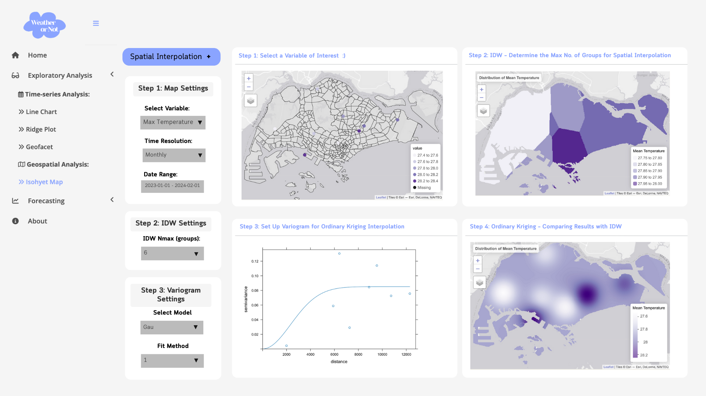

# 1 The Task

In this take-home exercise, you are required to select one of the module of your proposed Shiny application and complete the following tasks:

-   To evaluate and determine the necessary R packages needed for your Shiny application are supported in R CRAN,
-   To prepare and test the specific R codes can be run and returned the correct output as expected,
-   To determine the parameters and outputs that will be exposed on the Shiny applications, and
-   To select the appropriate Shiny UI components for exposing the parameters determine above.

# 2 Getting Started

Our group project focuses on Singapore's weather, and we aim to provide an interactive weather dashboard where users can explore and gain a deeper understanding of Singapore's weather trends.

I will be working on two modules: **EDA** - **Geospatial Analysis (Isohyet Map)** and **Forecasting**.

For a better understanding of these modules, please refer to our project proposal: [**Wheather or Not – Predicting the Unpredictable**](https://vaagroup13.netlify.app/team/project_proposal)

## 2.1 Load Packages

Below are the packages I'll be using for testing and building the prototypes. Since `pacman::p_load()` showed error messages when loading `gstat`, I'll use the `library()` function to load it instead:

```{r}
pacman::p_load(tidyverse,lubridate,knitr,zoo,DT,terra,sf,tmap)
```

```{r}
library(gstat)

```

| Package | Description |
|----|----|
| [tidyverse](https://www.tidyverse.org/) | For data manipulation |
| [DT](https://rstudio.github.io/DT/) | For interactive data tables |
| [knitr](https://yihui.org/knitr/) | For dynamic report generation with R |
| [lubridate](https://lubridate.tidyverse.org/) | For handling date-time data |
| [tmap](https://r-tmap.github.io/tmap/reference/index.html) | For drawing thematic maps |
| [sf](https://r-spatial.github.io/sf/) | Providing a standardized way to encode and analyze spatial vector data |
| [terra](https://rspatial.github.io/terra/) | For spatial data analysis (replaces the [raster](https://github.com/rspatial/raster) package) |
| [gstat](https://r-spatial.github.io/gstat/) | For spatial and spatio-temporal geostatistical modelling, prediction and simulation |

## 2.2 Import and Prepare Weather Data

```{r}
station<- read_csv("data/Singapore_daily_records.csv")
```

### 2.2.1 Review the data structure

There are 22,230 observations in the weather data, including 10 AWS stations and 5 years' records.

As shown in the table below, several variables have incorrect data formats. Transformations need to be made for these variables:

-   **station** should be a factor type

-   **rainfall**, **temperature**, and **wind speed** should be numeric types

-   **highest 30, 60 and 90 mm rainfall** columns contain character “\\u0997”, which should be replaced by NA

```{r}
str(station)
```

### 2.2.2 Handle Incorrect Data Format

The code chunk below is performed to address the data issues mentioned earlier:

```{r}
station <- station %>%
  mutate(across(
    c(highest_30_min_rainfall_mm, highest_60_min_rainfall_mm, highest_120_min_rainfall_mm,
      daily_rainfall_total_mm, mean_temperature_c, maximum_temperature_c, 
      minimum_temperature_c, mean_wind_speed_km_h, max_wind_speed_km_h,mean_temperature_a_c,
      maximum_temperature_a_c,minimum_temperature_a_c),
    ~ as.numeric(gsub("\u0097", NA, .))
  )) %>%
  mutate(station = as.factor(station))
```

### 2.2.3 Add Date and Week No.

As the weather data is a time-series data, it's necessary to add date information for further data analysis. The `lubridate` package is used for creating date and weekday columns:

```{r}
station <- station %>%
  mutate(date = ymd(paste(year, month, day, sep = "-")),
         Week_no = week(date))

# if Week_no =53, revise it to 52
station <- station %>%
  mutate(Week_no = ifelse(Week_no == 53, 52, Week_no))
```

### 2.2.4 Handle Missing Values

Let's check the data summary and missing values:

Except for columns "station", "year", "month" and "day", other columns contain lots of missing values, especially for temperature data (\*\_temperature_c and \*\_temperature_a_c) with over 17K and 6K missing values.

```{r}
summary(station)
```

```{r}
kable(data.frame(Column = names(station), NAs = colSums(is.na(station))))

```

#### 2.2.4.1 Missing Temperature_c and Temperature_a_c

However, upon closer inspection of the missing values, we discovered that the columns were switched: missing temperature_c values appeared in temperature_a_c, and vice versa. To maintain data integrity, we will use the `coalesce()` function to combine these values into the temperature_c column.

::: panel-tabset
## missing temperature_c

The table below shows records with missing values in mean_temperature_c

```{r}
station_filtered_c <- station %>%
  filter(is.na(mean_temperature_c))

kable(head(station_filtered_c,10))
```

## missing temperature_a_c

The table below shows records with missing values in mean_temperature_a_c

```{r}
station_filtered_a_c <- station %>%
  filter(is.na(mean_temperature_a_c))

kable(head(station_filtered_a_c,10))
```
:::

#### 2.2.4.2 Coalesce Temperature Data

The coalesce function combines values from min, max, and mean temperature columns (both temp_c and temp_a_c) to handle missing values, and remove the \_a_c columns:

```{r}
station$mean_temperature_c <- coalesce(station$mean_temperature_c, station$mean_temperature_a_c)
station$maximum_temperature_c <- coalesce(station$maximum_temperature_c, station$maximum_temperature_a_c)
station$minimum_temperature_c <- coalesce(station$minimum_temperature_c, station$minimum_temperature_a_c)

station <- station %>% 
  select(-c("mean_temperature_a_c", 
            "maximum_temperature_a_c", "minimum_temperature_a_c"))

```

Now, let's review the summary of missing values again. The number of missing values has dramatically decreased to 1000ish.

```{r}
kable(data.frame(Column = names(station), NAs = colSums(is.na(station))))
```

#### 2.2.4.3 **Remove Marina Barrage Station Data and Highest Rainfall Attributes**

As shown in the time-series plot, Marina Barrage has missing data since later half of year in 2022, since the missing value is too many, the station should be dropped

```{r}
ggplot(station, aes(x = date, y = mean_temperature_c, color = station, group = station)) +
  geom_line(linewidth = 1, alpha = 0.7) +
  facet_grid(~station)+
  coord_flip()+
  theme_minimal() +
  labs(title = "Mean temperature",
       x = "Date",
       y = "Mean temperature (celcius degree)") +
  theme(
    plot.title = element_text(face = "bold", hjust = 0.5),
    legend.title = element_blank(),
    legend.position = "top"
  )
```

```{r}
station <- station %>% filter(station != "Marina Barrage")
```

After removing Marina Barrage, the missing values are decreased:

```{r}
kable(data.frame(Column = names(station), NAs = colSums(is.na(station))))
```

#### 2.2.4.4 Handling Remaining Missing Values

Since the missing values are distributed throughout the dataset, and given that this is time-series weather data, removing entire rows would disrupt subsequent visualizations. To minimize analysis errors, interpolation is a more suitable approach for handling missing data.

Below are the methods used to address missing values for different attributes:

**Temperature Data:**

-   If both minimum and maximum temperature values are available, the mean temperature is interpolated as their average.

-   If temperature data is entirely missing, we use the **zoo** package to interpolate the mean temperature using moving averages over progressively larger windows: 7 days → 15 days → 30 days.

**Rainfall Data:**

-   If the daily total rainfall is **0** and the highest recorded rainfall is missing, we assume the missing values are also **0**.

-   If the daily total rainfall itself is missing, we apply the same moving average interpolation method as for temperature data.

**Wind Speed Data:**

-   If wind speed data is missing, we interpolate it using the **zoo** package with moving averages over progressively expanding windows: 7 days → 15 days → 30 days → 45 days → 60 days.

-   At stations with continuous missing values exceeding 30 days (Jurong West, Tai Seng, and Clementi), the moving average window is extended to 60 days to improve accuracy.

```{r}
#| echo: false
station_filtered_c <- station %>%
  filter(is.na(mean_temperature_c))

station_filtered_c %>%
  DT::datatable(class = "display",
                caption = "Table: Missing Values in Temp_c") %>%
  formatStyle(
    columns = colnames(station_filtered_c),
    fontSize = '12px',
    fontFamily = 'Helvetica',
    lineHeight = '1.2'
  )
```

```{r}
# Step 1: Interpolate mean temperature using min and max temp
station <- station %>%
  mutate(mean_temperature_c = ifelse(
    is.na(mean_temperature_c) & !is.na(minimum_temperature_c) & !is.na(maximum_temperature_c),
    round((minimum_temperature_c + maximum_temperature_c) / 2, 2),
    mean_temperature_c
  ))

# Step 2: Define funtion for rolling mean for remaining missing values
fill_missing_with_rollapply <- function(x, window_sizes) {
  for (w in window_sizes) {
    missing_idx <- which(is.na(x))
    if (length(missing_idx) == 0) break  # Stop if no missing values remain
    
    roll_values <- rollapply(x, width = w, FUN = mean, fill = NA, align = "center", na.rm = TRUE)
    x[missing_idx] <- ifelse(is.na(x[missing_idx]), round(roll_values[missing_idx],2), x[missing_idx])
  }
  return(x)
}
# Apply rolling mean imputation with increasing window sizes
window_sizes <- c(7, 15, 30, 45, 60)
station$mean_temperature_c <- fill_missing_with_rollapply(station$mean_temperature_c, window_sizes)
station$minimum_temperature_c <- fill_missing_with_rollapply(station$minimum_temperature_c, window_sizes)
station$maximum_temperature_c <- fill_missing_with_rollapply(station$maximum_temperature_c, window_sizes)
station$mean_wind_speed_km_h <- fill_missing_with_rollapply(station$mean_wind_speed_km_h, window_sizes)
station$max_wind_speed_km_h <- fill_missing_with_rollapply(station$max_wind_speed_km_h, window_sizes)
station$daily_rainfall_total_mm <- fill_missing_with_rollapply(station$daily_rainfall_total_mm, window_sizes)
```

```{r}
# Input 0 for missing highest rain fall
station <- station %>%
  mutate(
    highest_30_min_rainfall_mm = ifelse(daily_rainfall_total_mm == 0 & is.na(highest_30_min_rainfall_mm), 0, highest_30_min_rainfall_mm),
    highest_60_min_rainfall_mm = ifelse(daily_rainfall_total_mm == 0 & is.na(highest_60_min_rainfall_mm), 0, highest_60_min_rainfall_mm),
    highest_120_min_rainfall_mm = ifelse(daily_rainfall_total_mm == 0 & is.na(highest_120_min_rainfall_mm), 0, highest_120_min_rainfall_mm))

station <- station %>%
  select(-c(highest_30_min_rainfall_mm, highest_60_min_rainfall_mm, highest_120_min_rainfall_mm))

```

After interpolation, there are no missing values now:

```{r}
kable(data.frame(Column = names(station), NAs = colSums(is.na(station))))

```

## 2.3 Rename the Column

```{r}
station <- station %>%
  rename(`Mean Temperature` = mean_temperature_c,
         `Min Temperature`= minimum_temperature_c,
         `Max Temperature`= maximum_temperature_c,
         `Rainfall` = daily_rainfall_total_mm,
         `Mean Wind Speed` = mean_wind_speed_km_h,
         `Max Wind Speed` = max_wind_speed_km_h)
  
```

## 2.4 Generate weekly and monthly data

In the Shiny app, we will provide three time resolutions: **daily, weekly, and monthly**.

To aggregate data at the weekly and monthly levels, we will use the **`group_by`** and **`summarise`** functions to compute relevant summaries for each time period:

-   Monthly data

    ```{r}
    monthly <- station %>%
      group_by(station,year,month) %>%
      summarise(
        `Mean Temperature` = round(mean(`Mean Temperature`, na.rm = TRUE), 1),
        `Min Temperature` = min(`Min Temperature`, na.rm = TRUE),
        `Max Temperature` = max(`Max Temperature`, na.rm = TRUE),
        `Rainfall` = round(sum(`Rainfall`, na.rm = TRUE),1),
        `Mean Wind Speed` = round(mean(`Mean Wind Speed`, na.rm=TRUE),1),
        `Max Wind Speed` = max(`Max Wind Speed`, na.rm = TRUE),
        .groups = "drop"
      )

    monthly <- monthly %>%
      mutate(date = ymd(paste(year, month, 1, sep = "-")),
             `Max Wind Speed` = ifelse(`Max Wind Speed` == -Inf, NA, `Max Wind Speed`))
    ```

-   Weekly data

    ```{r}
    weekly <- station %>%
      group_by(station,year,month,Week_no) %>%
      summarise(
        `Mean Temperature` = round(mean(`Mean Temperature`, na.rm = TRUE), 1),
        `Min Temperature` = min(`Min Temperature`, na.rm = TRUE),
        `Max Temperature` = max(`Max Temperature`, na.rm = TRUE),
        `Rainfall` = round(sum(`Rainfall`, na.rm = TRUE),1),
        `Mean Wind Speed` = round(mean(`Mean Wind Speed`, na.rm=TRUE),1),
        `Max Wind Speed` = max(`Max Wind Speed`, na.rm = TRUE),
        .groups = "drop"
      )

    weekly <- weekly %>%
      mutate(date = as.Date(paste(year, Week_no, 1), format = "%Y %U %u"),
             `Max Wind Speed` = ifelse(`Max Wind Speed` == -Inf, NA, `Max Wind Speed`))
    ```

## 2.5 Save the files as RDS

```{r}
saveRDS(station, "data/station_daily_data.rds")
saveRDS(weekly, "data/station_weekly_data.rds")
saveRDS(monthly, "data/station_monthly_data.rds")
```

# 3 EDA - Isohyet Map

For the geospatial analysis, we will use Singapore's geospatial data — [Master Plan 2014 Subzone Boundary (Web) (SHP)](https://data.gov.sg/datasets?query=Master+Plan+2014+Subzone&page=1&resultId=d_d14da225fccf921049ab64238ff473d9) from URA and station data from MSS along with the `gstat`, `terra`, `sf`, and `tmap` packages to perform spatial interpolation and create an isohyet map.

## 3.1 Import Station Geospatial data

The code below import weather station geographical data (Longitude and Latitude):

```{r}
station_sf <- read_csv("data/RainfallStation.csv")
```

Next, we combine the daily, weekly and monthly weather data with the stations' geographical data, then use st_as_sf() from the **sf** package to convert the data into simple feature data.frame objects:

```{r}
weekly_station <- weekly %>%
  left_join(station_sf, by = c("station" = "Station"))

monthly_station <- monthly %>%
    left_join(station_sf, by = c("station" = "Station"))

daily_station <- station %>%
    left_join(station_sf, by = c("station" = "Station"))

```

```{r}
weekly_station_sf <- st_as_sf(weekly_station, 
                      coords = c("Longitude",
                                 "Latitude"),
                      crs= 4326) %>% # source data is in wgs84 
  st_transform(crs = 3414) 

monthly_station_sf <- st_as_sf(monthly_station, 
                      coords = c("Longitude",
                                 "Latitude"),
                      crs= 4326) %>% 
  st_transform(crs = 3414)

daily_station_sf <- st_as_sf(daily_station, 
                      coords = c("Longitude",
                                 "Latitude"),
                      crs= 4326) %>% 
  st_transform(crs = 3414)
```

## 3.2 Import Singapore Subzone Boundary Data

```{r}
mpsz <- st_read(dsn="data/geospatial",
                layer ="MP14_SUBZONE_WEB_PL")%>%
  st_transform(crs = 3414)
```

Let's use tmap to view the locations of the stations:

```{r}
tmap_mode("view")

tm_shape(mpsz) +
  tm_borders() +
tm_shape(weekly_station_sf) +
  tm_basemap("Esri.WorldTopoMap") +
  tm_bubbles(col = "#E8C8DB",
             size = 1,
             border.col = "black",
             border.lwd = 1,
             id = "station",
             popup.vars=c("Name: " = "station"))
```

Next, we use the tm_dots layer to display mean temperature across nine stations:

```{r}
# Assume the user set date range to 2023-01-01~2024-02-1  
start_date <- as.Date("2023-01-01")
end_date <- as.Date("2024-02-01")

# Assume the user choose monthly data
time_resolution_input <- "monthly"
time_resolution_table <- switch(time_resolution_input,
                                daily = daily_station_sf,
                                weekly = weekly_station_sf,
                                monthly = monthly_station_sf)
# Assume the user choose mean_temperature
variable <- "Mean Temperature"

station_summary <- time_resolution_table %>%
  filter(date >= start_date & date <= end_date) %>%
  group_by(station) %>%
  summarize(value = mean(get(variable), na.rm = TRUE))

```

```{r}
tmap_mode("view")

tm_shape(mpsz) +
  tm_borders(alpha = 0.6) +
tm_shape(station_summary) +
  tm_dots(col = "value", palette = "brewer.purples", size = 0.8, alpha = 0.9, title = variable)

```

## 3.2 Spatial Interpolation

Since we have data from only 9 stations, spatial interpolation is needed to visualize the weather data. We will test two methods — **Inverse Distance Weighting** and **Ordinary** **Kriging** for spatial Interpolation.

### 3.2.1 Spatial Interpolation - **Inverse Distance Weighting**

**Inverse Distance Weighting (IDW)** is a spatial interpolation method that estimates unknown values at a location based on the values of nearby points. The closer a known point is to the unknown point, the greater its influence.

#### 3.2.1.1 Simulate User Settings

```{r}
# Assume the user set date range to 2023-01-01~2024-02-1  
start_date <- as.Date("2023-01-01")
end_date <- as.Date("2024-02-01")

# Assume the user choose monthly data
time_resolution_input <- "monthly"
time_resolution_table <- switch(time_resolution_input,
                                daily = daily_station_sf,
                                weekly = weekly_station_sf,
                                monthly = monthly_station_sf)
# Assume the user choose mean_temperature
variable <- "Mean Temperature"

station_summary <- time_resolution_table %>%
  filter(date >= start_date & date <= end_date) %>%
  group_by(station) %>%
  summarize(value = mean(get(variable), na.rm = TRUE))
```

#### 3.2.1.2 Create Grid Data Object

To begin with, we need to create an empty grid data for interpolation. The `rast()` function from the **terra** package in R is used to create **raster objects**, which represent spatial data as grids (matrices of values).

```{r}
grid <- terra::rast(mpsz, 
                    nrows = 345, 
                    ncols = 537)
grid
```

#### 3.2.1.3 Extract Coordinates from the Grid

-   `ncell(grid)`: return total number of cells in the grid

-   `xyFromCell(grid, 1:ncell(grid))`: Extracts **X, Y coordinates** of all cell centers

```{r}
xy <- terra::xyFromCell(grid, 
                        1:ncell(grid)) 
head(xy)
```

#### 3.2.1.4 Convert Grid Points to a SF Object

```{r}
coop <- st_as_sf(as.data.frame(xy), 
                 coords = c("x", "y"),
                 crs = st_crs(mpsz))
coop <- st_filter(coop, mpsz)

coop
```

#### 3.2.1.5 IDW interpolation

With everything now configured, we can predict values for unsampled locations:

```{r}
res <- gstat(formula = value ~ 1, 
             locations = station_summary, 
             nmax = 6,
             set = list(idp = 0))

resp <- predict(res, coop)

```

```{r}
resp$x <- st_coordinates(resp)[,1]
resp$y <- st_coordinates(resp)[,2]
resp$pred <- resp$var1.pred

pred <- terra::rasterize(resp, grid, 
                         field = "pred", 
                         fun = "mean")
```

#### 3.2.1.6 **Mapping the Interpolated Rainfall Raster**

We will map the interpolated surface by using tmap functions as shown in the code chunk below:

```{r}
tmap_mode("view")


title_text <- paste("Distribution of", variable)
legend_text <- paste(variable)

tm_shape(pred) + 
 tm_raster(col_alpha = 0.6, 
            col.scale = tm_scale(
              values = "brewer.purples"),
            col.legend = tm_legend(legend_text)) +
  tm_title(title_text) + tm_layout(frame = TRUE)
```

### 3.2.2 Spatial Interpolation - Ordinary **Kriging**

**Ordinary Kriging** is a geostatistical interpolation method that estimates values at unknown locations based on the spatial autocorrelation of known data points. Unlike **Inverse Distance Weighting (IDW)**, Kriging accounts for both distance and the structure of spatial variation using a **variogram model**.

Kriging can be understood as a two-step process:

1.  The **spatial covariance** structure of the sampled points is determined by fitting a **variogram**
2.  Weights derived from this covariance structure are used to interpolate values for unsampled points or blocks across the spatial field

#### 3.2.2.1 **Working with gstat:** variogram()

Firstly, we will calculate and examine the empirical variogram by using `variogram()` of **gstat** package. 

```{r}
v <- variogram(value ~ 1, 
               data = station_summary)
plot(v)

```

#### 3.2.2.2 Fit the variogram model

**Matérn(Mat), Gaussian(Gau), Periodic(Per)** are most commonly used for weather and climate data:

```{r}
fv <- fit.variogram(object = v,
                    model = vgm(
                      model = c("Gau"),
                      nugget = 0.01), # Initial vertical jump in the variogram
                    fit.method = 1)
fv
```

```{r}
plot(v, fv)
```

```{r}
k <- gstat(formula = value ~ 1, 
           data = station_summary, 
           model = fv)
k
```

```{r}
resp <- predict(k, coop)
resp$x <- st_coordinates(resp)[,1]
resp$y <- st_coordinates(resp)[,2]
resp$pred <- resp$var1.pred
resp$pred <- resp$pred
```

```{r}
kpred <- terra::rasterize(resp, grid, 
                         field = "pred")
kpred
```

```{r}
tmap_mode("view")

title_text <- paste("Distribution of", variable)
legend_text <- paste(variable)

tm_shape(kpred) + 
  tm_raster(col_alpha = 0.6, 
            col.scale = tm_scale_continuous(
              values = "brewer.purples"),
            col.legend = tm_legend(legend_text)) +
  tm_title(title_text) + tm_layout(frame = TRUE)
```

# 4 Prototype for Isohyet Map

{fig-align="center"}

# 5 Reference

-   Kam, T.S. (2025). [Analysing and Visualising Spatial Interpolation](https://r4va.netlify.app/chap24)
